# TraceGenAI  
### Agentic AI for SDLC Traceability

**TraceGenAI** is an enterprise-grade **multi-agent AI system** that automates **SDLC traceability** by converting **requirements, design, and code context** into **validated, traceable test cases**, delivered as **Excel artifacts** for real-world QA and audit workflows.

The system is built with a **deterministic execution model**, **validation-first AI design**, and **security-aware architecture**, making it suitable for enterprise and compliance-driven environments.

---

## Architecture Overview (End-to-End Flow)

```mermaid
flowchart LR
    A[Project / Business Context<br/>• Requirements<br/>• Design Notes<br/>• Codebase]:::input
    --> B[Requirements Agent<br/>• Extracts Functional & NFRs<br/>• Structured JSON Output]:::agent
    --> C[Design Agent<br/>• Derives Architecture<br/>• Maps Components]:::agent
    --> D[Code Analysis Agent<br/>• Extracts APIs<br/>• Identifies UI & Flows]:::agent
    --> E[Test Case Generation Agent<br/>• Enterprise Test Cases<br/>• Full Traceability]:::agent
    --> F[Validation Layer<br/>• Schema Enforcement<br/>• Mandatory Checks]:::validation
    --> G[Excel Output<br/>• QA-Ready XLSX<br/>• Audit Friendly]:::output

    classDef input fill:#e3f2fd,stroke:#1565c0,stroke-width:1px;
    classDef agent fill:#ede7f6,stroke:#5e35b1,stroke-width:1px;
    classDef validation fill:#fff3e0,stroke:#ef6c00,stroke-width:1px;
    classDef output fill:#e8f5e9,stroke:#2e7d32,stroke-width:1px;
```



---

## How the System Works

- The pipeline executes in a **fixed, deterministic order**
- Each agent has a **single, clearly defined responsibility**
- Outputs from one stage become **validated inputs** for the next
- LLMs are used only where reasoning is required
- A validation gate ensures **no untrusted AI output reaches final artifacts**

This mirrors how **real enterprise SDLC workflows** operate.

---

## Key Capabilities

- Multi-agent SDLC pipeline (requirements → design → code → tests)
- End-to-end traceability across all SDLC artifacts
- Validation-first AI (LLM output treated as untrusted)
- Code-aware test generation (no hallucinated APIs or flows)
- Excel-based output aligned with enterprise QA practices
- RAG-ready architecture for future grounding and reuse

---

## Getting Started (Clone & Run)

### Prerequisites
- Python 3.10 or higher  
- Git  
- An LLM provider account (OpenAI / OpenRouter compatible)

### 1. Clone the Repository
```bash
git clone https://github.com/arunprasath403/TraceGenAI.git
cd TraceGenAI
```

### 2. Create a Virtual Environment
```bash
python -m venv venv
```

Activate it:

**Windows**
```bash
venv\Scripts\activate
```

**Linux / macOS**
```bash
source venv/bin/activate
```

### 3. Install Dependencies
```bash
pip install -r requirements.txt
```

### 4. Configure Environment Variables
Create a `.env` file **locally** (do not commit it):

```env
OPENROUTER_API_KEY=your_api_key_here
OPENROUTER_BASE_URL=https://openrouter.ai/api/v1
LLM_MODEL_NAME=gpt-4o-mini
LLM_TEMPERATURE=0.2
```

### 5. Run the Application (Streamlit UI)
```bash
python -m streamlit run ui/app.py
```

---

## Working on the Project

1. Update project context or input data  
2. Modify or extend individual agents  
3. Run the pipeline via Streamlit  
4. Validate generated test cases  
5. Review Excel output  

Each agent can be enhanced independently without impacting the rest of the pipeline.

---

## Project Structure

```text
agents/     multi-agent logic
tools/      validation, Excel generation, parsing
rag/        retrieval and vector store
utils/      shared project context
config/     settings and logging
ui/         Streamlit interface
main.py     pipeline orchestrator
```

---

## Security & Reliability

- No hardcoded secrets
- Environment-based configuration
- Strict output validation
- Prompt-injection-aware design
- Logging avoids sensitive data

---

## Use Cases

- Enterprise QA automation
- SDLC traceability and compliance
- AI-assisted manual testing
- Internal engineering tooling

---

## Author

**Arun Prasath**  
GenAI Engineer | Agentic AI | Enterprise Automation

---

### Final Note

TraceGenAI is built with a **production mindset**, not as a demo.  
The architecture emphasizes **clarity, control, and traceability**, which are essential for real-world SDLC automation.
